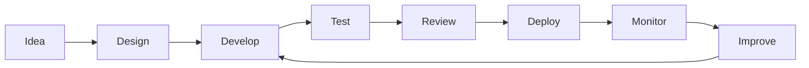

<div align="center">


<br/>


<br/><br/>

<a href="https://github.com/lequythien">
  
</a>

</div>

---

## 👋 About Me

```ts
const developer = {
  name: "Lê Quý Thiện",
  role: "Frontend Developer",
  focus: [
    "Modern Web Applications",
    "Responsive UI Development",
    "Frontend Architecture",
    "API Integration",
    "Internationalization"
  ],
  primaryStack: [
    "React",
    "Next.js",
    "TypeScript",
    "JavaScript"
  ],
  uiStack: [
    "Material UI",
    "Tailwind CSS"
  ],
  workflow: [
    "Git",
    "GitHub",
    "REST API",
    "Postman",
    "PM2"
  ],
  mindset: "Clean code. Practical solutions. Continuous improvement."
};
```

<p align="center">
  <b>Frontend Developer</b> focused on building modern, responsive and maintainable web applications.
  <br/>
  I work primarily with <b>React</b>, <b>Next.js</b>, <b>TypeScript</b> and modern UI frameworks,
  <br/>
  with an emphasis on reusable components, responsive interfaces, API integration and production-ready development.
</p>

---

## ⚡ Tech Stack

<div align="center">

### Frontend


<br/><br/>

### UI & Styling


<br/><br/>

### Backend / API / Tools


</div>

---

## 🧩 Development Focus

<table align="center">
<tr>
<td width="50%" valign="top">

### ⚛️ Frontend Engineering

* React & Next.js applications
* Component-based architecture
* TypeScript development
* Reusable UI components
* Responsive Web Design
* Mobile-first interfaces
* Form & state management
* Performance-oriented UI

</td>

<td width="50%" valign="top">

### 🎨 UI Engineering

* Material UI
* Tailwind CSS
* Design system implementation
* Responsive layouts
* Cross-device compatibility
* Accessibility considerations
* Consistent UI patterns
* Clean visual hierarchy

</td>
</tr>

<tr>
<td width="50%" valign="top">

### 🔌 API & Integration

* REST API integration
* Authentication flows
* Data fetching
* API testing with Postman
* Error & loading states
* Frontend ↔ Backend integration
* Multi-language API/content handling

</td>

<td width="50%" valign="top">

### 🌍 Production & Workflow

* Git & GitHub
* Branch-based development
* Environment configuration
* Production deployment
* PM2 process management
* i18n implementation
* Debugging & maintenance
* Continuous improvement

</td>
</tr>
</table>

---

## 🌐 Internationalization

I have experience working with multilingual web applications and localization workflows.

<div align="center">

🇻🇳 **Vietnamese**   •  
🇬🇧 **English**   •  
🇯🇵 **Japanese**   •  
🇰🇷 **Korean**   •  
🇨🇳 **Chinese**

</div>

<br/>

```text
i18n
├── vi
├── en
├── ja
├── ko
└── zh
```

---

## 🛠️ What I Care About

```text
01. Clean & Maintainable Code
02. Reusable Components
03. Responsive User Interfaces
04. Consistent Design Systems
05. Type Safety
06. API Reliability
07. Production Stability
08. Developer Experience
09. Performance
10. Continuous Learning
```

> Good frontend development is not only about making a UI look good —
> it's about making it **usable, maintainable, scalable and reliable**.

---

## 📊 GitHub Activity

<div align="center">

<a href="https://github.com/lequythien">


</a>

</div>

<br/>

<div align="center">


</div>

---

## 🐍 Contribution Graph

<div align="center">

<picture>
  <source
    media="(prefers-color-scheme: dark)"
    srcset="https://raw.githubusercontent.com/lequythien/lequythien/output/github-contribution-grid-snake-dark.svg">
  <source
    media="(prefers-color-scheme: light)"
    srcset="https://raw.githubusercontent.com/lequythien/lequythien/output/github-contribution-grid-snake.svg">
  
</picture>

</div>

---

## 🚀 Development Workflow

<div align="center">



</div>

---

## 📌 Currently

```text
▸ Building modern web applications
▸ Improving frontend architecture
▸ Working with React & Next.js
▸ Developing responsive interfaces
▸ Integrating REST APIs
▸ Working with multilingual applications
▸ Improving code quality and performance
```

---

## 🤝 Connect

<div align="center">

<a href="https://github.com/lequythien">
  
</a>

<a href="mailto:zacubj2@gmail.com">
  
</a>

<a href="https://www.tiktok.com/@zacubj2">
  
</a>

<br/><br/>

<a href="https://github.com/lequythien">
  
</a>

</div>

---

<div align="center">

### 💻 Code is a craft.

**Build · Learn · Improve · Repeat.**

<br/>


</div>
